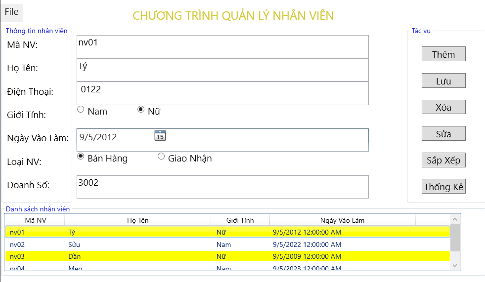

# QuanLyNhanVien - Employee Management System

## Overview

QuanLyNhanVien is a simple WPF (Windows Presentation Foundation) application for managing employee information. This application allows you to add, edit, delete, and view employee data. It also includes features for sorting employees by seniority and displaying statistics.

## Features

- Add new employees with details such as name, ID, phone number, date of joining, gender, and job type.
- Edit existing employee information.
- Delete employees with confirmation prompts.
- Sort employees by seniority and name.
- Display statistics about the number of employees in different job types and their total salaries.

## Prerequisites

- Windows operating system
- .NET Framework (or .NET Core) installed
- Visual Studio (or another C# development environment) for building and running the application

## Getting Started

1. Clone or download this repository to your local machine.

2. Open the project in Visual Studio.

3. Build and run the application.

4. Use the application to manage employee data as needed.

## Usage

- To add a new employee, click the "Thêm" (Add) button and fill in the employee details.

- To save a new employee, click the "Lưu" (Save) button to save the employee information into Listview.

- To edit an existing employee, select the employee in the ListView, make changes, and click the "Sửa" (Edit) button.

- To delete an employee, select the employee in the ListView and click the "Xóa" (Delete) button. Confirm the deletion when prompted.

- To sort by employee seniority, click the "Sắp xếp" (Sort) button.

- To view statistics, click the "Thống kê" (Statistics) button.

## Contributing

Contributions are welcome! If you have ideas for improvements or bug fixes, please create a pull request.
